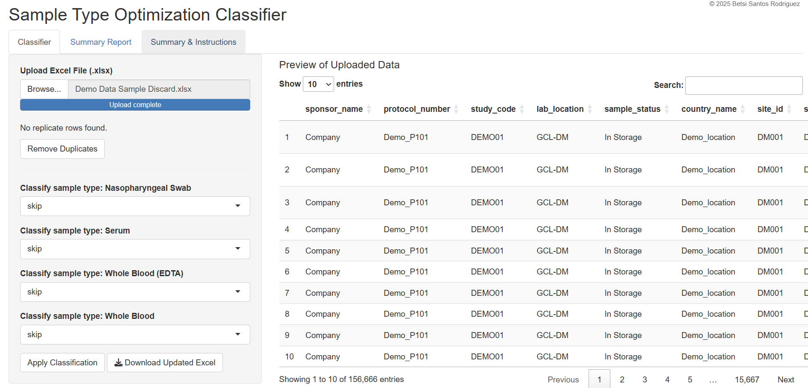

# Biospecimen/ Sample Discard Type Optimization Classifier

**An R Shiny app to automate duplicate‐detection and “keep vs. discard” decisions on large biosample datasets 
~23,000 to 500,000 rows of data of long term storage samples.**

---

## 🚀 Key Features

- **Duplicate Detection & Cleanup**  
  - Auto-scan Excel uploads for exact/near duplicates  
  - One-click removal to ensure a clean dataset  

- **Flexible Classification**  
  - **Bulk mode**: Assign entire sample types to “keep” or “discard”  
  - **Manual-select**: Retain exactly _Number_ samples per patient visit (e.g. to keep 3 of 8 serum tubes)  
  - Prioritizes specimens without stability flags, shipment history, or adverse comments  

- **Interactive Summaries & Export**  
  - In-app preview of raw vs. classified data
     
  - Pivot-style report by sample_type × screen_id × visit_name  
  - Downloadable Excel: full data + summary + instructions + embedded chart  

---

## 🛠️ Tech Stack

- **Language:** R (≥ 4.1)  
- **Framework:** Shiny  
- **Packages:**  
  - Data handling: `readxl`, `dplyr`, `tidyr`, `janitor`  
  - UI & tables: `DT`, `shiny`  
  - Reporting: `openxlsx`, `ggplot2`  
  - Reproducibility: `renv`  

---

## 🔧 Installation & Setup

Installation & Setup Guide
**1. Prerequisites**
R (v4.0+)

RStudio (recommended)

Required R packages:
r
install.packages(c("shiny", "readxl", "dplyr", "DT", "openxlsx", "tidyr", "ggplot2", "janitor"))

**2. Installation Methods**
## Quick Start
Run this in R:
```r
shiny::runGitHub(
  repo = "Biospecimen-Discard-Optimization-Classifier",
  username = "BetsiRosiely", 
  subdir = "app"  # Required because your app.R is inside /app
)
```
